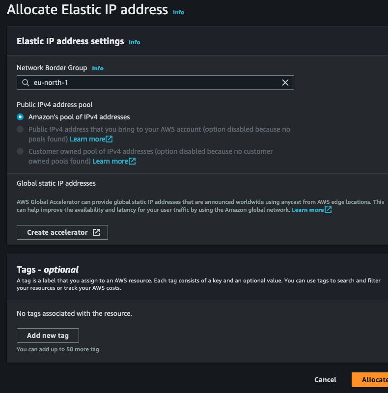
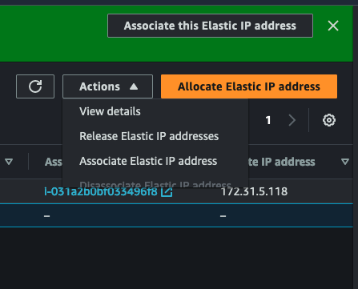
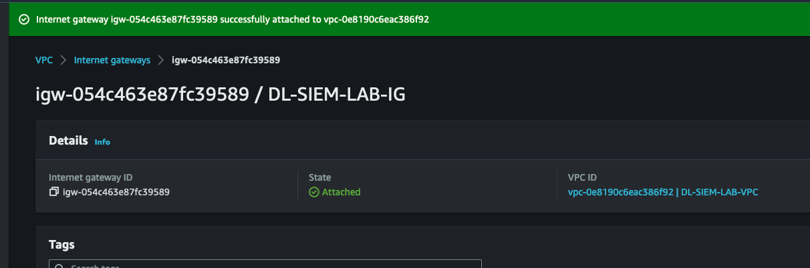

# Creating a Graylog Lab Environment in AWS

## Installation Method

## System Requirements

## AWS Environment Explanation

> VPC Name (DL-SIEM-LAB)
    > Default AWS 172.31.0.0/16
    > Subnet name = DL-SIEM-LAB-SN
        > Subnet Range 172.31.16.0/16

### Ubuntu Server (Jesus Christ I'm falling asleep already)

> pem ket  == /DlSIEM/DL_LAB.pem

## To do for UbServer
>
> Set the server a static IP address
> Install graylog version 5.1
> Go to port 9000 on the <AWS-Public-IP-address> to see if it works

First time connecting
     Open an SSH client.

    Locate your private key file. The key used to launch this instance is DL_LAB.pem

    Run this command, if necessary, to ensure your key is not publicly viewable.

 chmod 400 DL_LAB.pem

Connect to your instance using its Public DNS:

     ec2-13-53-188-244.eu-north-1.compute.amazonaws.com

Example:
 ssh -i "DL_LAB.pem" <ubuntu@ec2-13-53-188-244.eu-north-1.compute.amazonaws.com>

### Installing MongoDB 4.4

**Finding the issue**
ubuntu@ip-172-31-5-118:~$ sudo systemctl enable mongod
ubuntu@ip-172-31-5-118:~$ dpkg -l | grep mongod
ii  mongodb-database-tools             100.7.3                           amd64        mongodb-database-tools package provides tools for working with the MongoDB server:
ii  mongodb-mongosh                    1.10.1                            amd64        MongoDB Shell CLI REPL Package
hi  mongodb-org                        6.0.8                             amd64        MongoDB open source document-oriented database system (metapackage)
ii  mongodb-org-database               6.0.8                             amd64        MongoDB open source document-oriented database system (metapackage)
ii  mongodb-org-database-tools-extra   6.0.8                             amd64        Extra MongoDB database tools
hi  mongodb-org-mongos                 6.0.8                             amd64        MongoDB sharded cluster query router
hi  mongodb-org-server                 6.0.8                             amd64        MongoDB database server
hi  mongodb-org-shell                  6.0.8                             amd64        MongoDB shell client
hi  mongodb-org-tools                  6.0.8                             amd64        MongoDB tools
ubuntu@ip-172-31-5-118:~$ sudo service mongod stop

**Removing MongoDB**
ubuntu@ip-172-31-5-118:~$ sudo apt-get purge mongodb-org*

**Fixing the issue**

ubuntu@ip-172-31-5-118:~$ ls /etc/apt/sources.list.d/

mongodb-org-4.4.list  mongodb-org-6.0.list  opensearch-2.x.list

ubuntu@ip-172-31-5-118:~$ sudo rm /etc/apt/sources.list.d/mongodb-org-6.0.list

ubuntu@ip-172-31-5-118:~$ sudo rm -r /var/log/mongodb
ubuntu@ip-172-31-5-118:~$ sudo rm -r /var/lib/mongodb

**Installing after correction**
ubuntu@ip-172-31-5-118:~$ ls /etc/apt/sources.list
sources.list    sources.list.d/
ubuntu@ip-172-31-5-118:~$ ls /etc/apt/sources.list
sources.list    sources.list.d/
ubuntu@ip-172-31-5-118:~$ ls /etc/apt/sources.list.d/
mongodb-org-4.4.list  mongodb-org-6.0.list  opensearch-2.x.list
ubuntu@ip-172-31-5-118:~$ rm /etc/apt/sources.list.d/mongodb-org-
mongodb-org-4.4.list  mongodb-org-6.0.list  
ubuntu@ip-172-31-5-118:~$ rm /etc/apt/sources.list.d/mongodb-org-6.0.list
rm: remove write-protected regular file '/etc/apt/sources.list.d/mongodb-org-6.0.list'? yes
rm: cannot remove '/etc/apt/sources.list.d/mongodb-org-6.0.list': Permission denied
ubuntu@ip-172-31-5-118:~$ sudo rm /etc/apt/sources.list.d/mongodb-org-6.0.list

ubuntu@ip-172-31-5-118:~$ sudo apt list  mongodb-org
Listing... Done
mongodb-org/focal 4.4.22 amd64
mongodb-org/focal 4.4.22 arm64
ubuntu@ip-172-31-5-118:~$ sudo apt-get install -y mongodb-org

ubuntu@ip-172-31-5-118:~$ sudo systemctl daemon-reload
ubuntu@ip-172-31-5-118:~$ sudo systemctl enable mongod.service
ubuntu@ip-172-31-5-118:~$ sudo systemctl restart mongod.service
ubuntu@ip-172-31-5-118:~$ sudo systemctl --type=service --state=active | grep mongod
  mongod.service                                 loaded active running MongoDB Database Server

### Installing Elastic Search

<wget -q <https://artifacts.elastic.co/GPG-KEY-elasticsearch> -O myKey>

<sudo apt-key add myKey>

> OK

<echo "deb <https://artifacts.elastic.co/packages/oss-7.x/apt> stable main" | sudo tee -a /etc/apt/sources.list.d/elastic-7.x.list>

> deb <https://artifacts.elastic.co/packages/oss-7.x/apt> stable main

<sudo apt-get update && sudo apt-get install elasticsearch-oss>

<sudo nano /etc/elasticsearch/elasticsearch.yml>

<sudo systemctl daemon-reload>

<sudo systemctl enable elasticsearch.service>

> Synchronizing state of elasticsearch.service with SysV service script with /lib/systemd/systemd-sysv-install.
> Executing: /lib/systemd/systemd-sysv-install enable elasticsearch
> Created symlink /etc/systemd/system/multi-user.target.wants/elasticsearch.service → /lib/systemd/system/elasticsearch.service.

<sudo systemctl restart elasticsearch.service>

<sudo systemctl --type=service --state=active | grep elasticsearch>

> elasticsearch.service                          loaded active running Elasticsearch

password_secret
    4C0AFCRObfCQP9i00NBgurJFuiTNQBbUMnEOC6kcBtBFddzglv4cZvPALmYKT7wfRmcirvs5yLFmy3jb6SS70xwY42rQKURk

root_password_sha2
    > H@vingAGrand0ldT1me468%
    > 0c5f5fc24fddba68e7ceb234b85db615519f80178ff5005ef501efd38e81e18c

#### Creating a Reverse Proxy using NGINX or Apache

Commands and notes:

> sudo apt update

> sudo apt install python3-certbot-nginx

Next we need to install Nginx
> sudo apt install nginx

# Ubuntu / Debian
>
> sudo apt update
> sudo apt install certbot
> certbot --version
>

> Install NGINX
    > Configure NGINX
> Test NGINX

> Useful SSL generator
    > Mozilla SSL Configuration Generator
        > <https://ssl-config.mozilla.org/>
    > Create the keys using Let's encrypt SSL

> Sort out DNS via cloudflare
> My goal is to translate the AWS IP address **13.49.36.165:9000** to **siem.lab.defencelogic.io**  

### How to do this

### How to do Nginx

> Let's start with going over HTTP first

Command: sudo apt install python3-certbot-nginx

**Explanation:**

- This command installs the package `python3-certbot-nginx` along with its dependencies.

Command: sudo apt install nginx

**Explanation:**

- This command installs the `nginx` package.

Command: cd /etc/nginx

**Explanation:**

- This command changes the current directory to `/etc/nginx`.

Command: ls

**Explanation:**

- This command lists the files and directories in the current directory.

Command: cd sites-available/

**Explanation:**

- This command changes the current directory to `/etc/nginx/sites-available/`.

Command: ls

**Explanation:**

- This command lists the files in the `sites-available` directory.

**Output**

<default>

Command: sudo nano graylog-lab.conf

**Explanation:**

- This command opens the file `graylog-lab.conf` for editing using the `nano` text editor with superuser privileges.

1. Go to <https://ssl-config.mozilla.org/#server=nginx&version=1.17.7&config=intermediate&openssl=1.1.1k&guideline=5.7> to fill out the 

Command: sudo system

**Explanation:**

- This command appears to be incomplete and may not be a valid command.

Command: nginx -t

**Explanation:**

- This command checks the syntax of the nginx configuration files and reports any errors.

Command: sudo rm sites-enabled/default.conf

**Explanation:**

- This command attempts to remove the default nginx `default.conf`, but it may fail if the directory is not empty.

Command: ls

**Explanation:**

- This command lists the files and directories in the current directory.

Command: sudo nano sites-available/graylog-lab.conf

**Explanation:**

- This command opens the file `graylog-lab.conf` for editing using the `nano` text editor with superuser privileges.

Command: sudo nginx -t

**Explanation:**

- This command checks the syntax of the nginx configuration files and reports any errors, using superuser privileges.

The output during the `nginx -t` command is as follows:

- **Error**: could not open error log file: open() "/var/log/nginx/error.log" failed (13: Permission denied)
  - **Explanation**: The user running the `nginx` command does not have permission to open the error log file. Check file permissions.

- **Warning**: the "user" directive makes sense only if the master process runs with super-user privileges, ignored in /etc/nginx/nginx.conf:1
  - **Explanation**: The `user` directive in the nginx configuration file is being ignored since the master process is not running with super-user privileges.

- **Error**: open() "/run/nginx.pid" failed (13: Permission denied)
  - **Explanation**: The nginx process cannot open the `/run/nginx.pid` file due to insufficient permissions. Check file and directory permissions.

- **Error**: a duplicate default server for 0.0.0.0:80 in /etc/nginx/sites-enabled/graylog-lab.conf:4
  - **Explanation**: There is a duplicate default server configuration in the `graylog-lab.conf` file. Each server block must be unique.

- **Error**: cannot load certificate "/path/to/signed_cert_plus_intermediates": BIO_new_file() failed (SSL: error:02001002:system library:fopen:No such file or directory:fopen('/path/to/signed_cert_plus_intermediates','r') error:2006D080:BIO routines:BIO_new_file:no such file)
  - **Explanation**: Nginx cannot load the SSL certificate specified by the given path. Check the path and ensure the file exists.

- **Error**: directive "server_name" is not terminated by ";" in /etc/nginx/sites-enabled/graylog-lab.conf:8
  - **Explanation**: There is a syntax error in the `graylog-lab.conf` file. The `server_name` directive is missing a semicolon (;).

>

HTTP conf server
{
    listen 80 default_server;
    listen [::]:80 default_server ipv6only=on;
    server_name siem.lab.defencelogic.io;

    location / {
      proxy_set_header Host $http_host;
      proxy_set_header X-Forwarded-Host $host;
      proxy_set_header X-Forwarded-Server $host;
      proxy_set_header X-Forwarded-For $proxy_add_x_forwarded_for;
      proxy_set_header X-Graylog-Server-URL http://$server_name/;
      proxy_pass       http://127.0.0.1:9000;
    }
}

> Work on HTTPS after
    >
email to use when tunning the command sudo certbot -d siem.lab.defencelogic.io
soc@defencelogic.io

#### Allocating an Elastic IP to the Graylog Server

> Go to the EC2 dashboard
> Go to Network & Security
    > Elastc IP's

> Go to the top-right -> click <Allocate Elastic IP address>

> Select Amazon's Pool of IP addresses (It's the only one)

> Click Allocate
> Back on the dashbaord, click on <Associate this Elastic IP address>

## Windows hosts

### Windows Domain Controller

Password = 
    dbQcjfRcfa!.lT@84CmXjcGj=LAJOYnM
Ket file =
    /DlSIEM/Windows_Server_SiemLab.pem
RdP file = 
    /DlSIEM/WindowsServerLab.rdp

> Create a Windows Server 2022 instance 
    > Create a new security group for the Windows Hosts

When creating another Elastic IP, I ran into this problem:

This was fixed by attaching a new internet gateway to the (DL-SIEM-LAB-VPC)

#### You may be asking,"What the fuck is an Elastic IP or Internet Gateway?"

> Uncle GPT Here:

**Internet Gateway:**

- An Internet Gateway (IGW) is an AWS service that allows your Amazon Virtual Private Cloud (VPC) to connect with the internet. It enables outbound and inbound communication between your VPC and the internet, allowing your VPC instances to access the internet and receive traffic from the internet.

**Elastic IP:**

- An Elastic IP (EIP) is a static, public IPv4 address associated with your AWS account. It provides a fixed IP address that you can assign to your AWS resources, such as EC2 instances. Elastic IPs are particularly useful when you need a consistent public IP address for your instances, even if they are stopped or restarted.

### Windows End-User Device

### Setup a VPN to connect to the windows host

### Windows DC

Setup as a domain controller

Build a domain

Setup static private IP 

Windows DC password 
  T(lJ2eP$iAm5cEhHt!%SSBzBsDJDtVwL

Domain Controller Emergency Password 
    0J3susFuck1ngChr1$t

### Windows 11 install 

password

  yeetus
  yeets
  yeetes

#### Graylog sidecar instllation
  1.2.x	3.2.5 or higher

  qemu-img convert -f qcow2 ubuntu-desktop-22.04.qcow2 -O vdi ubuntu-desktop-22.04.vdi