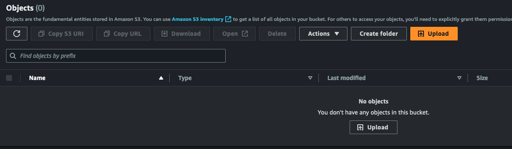
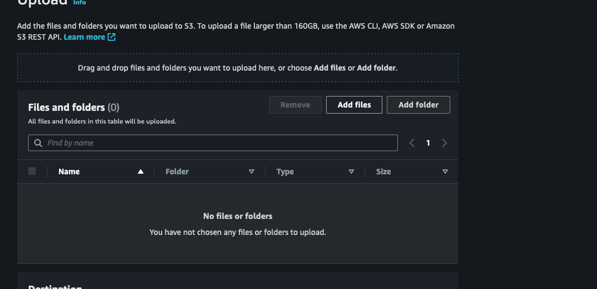
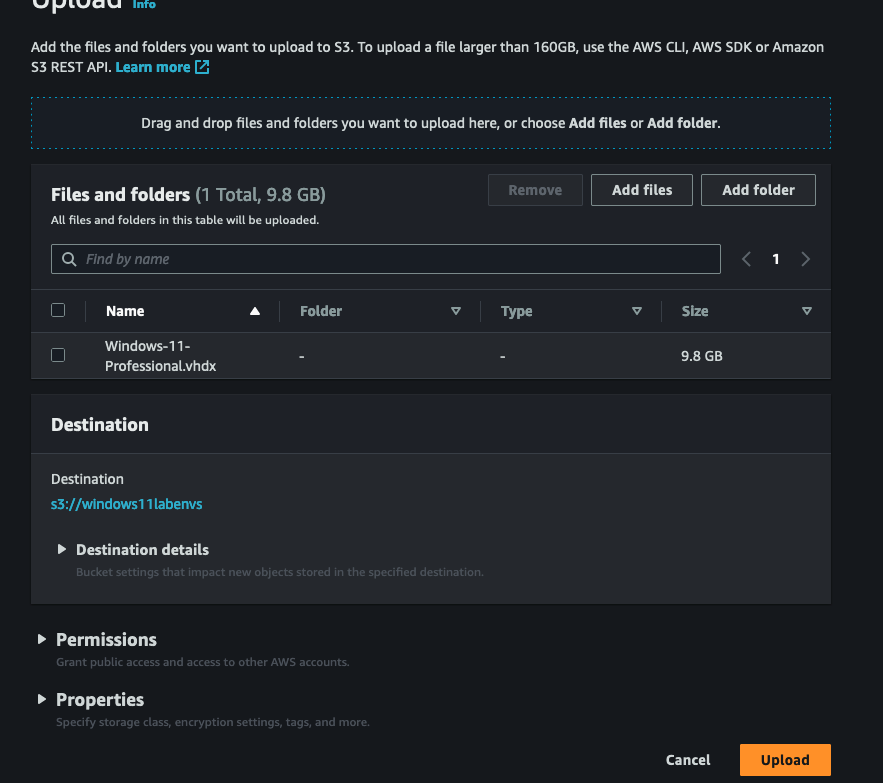
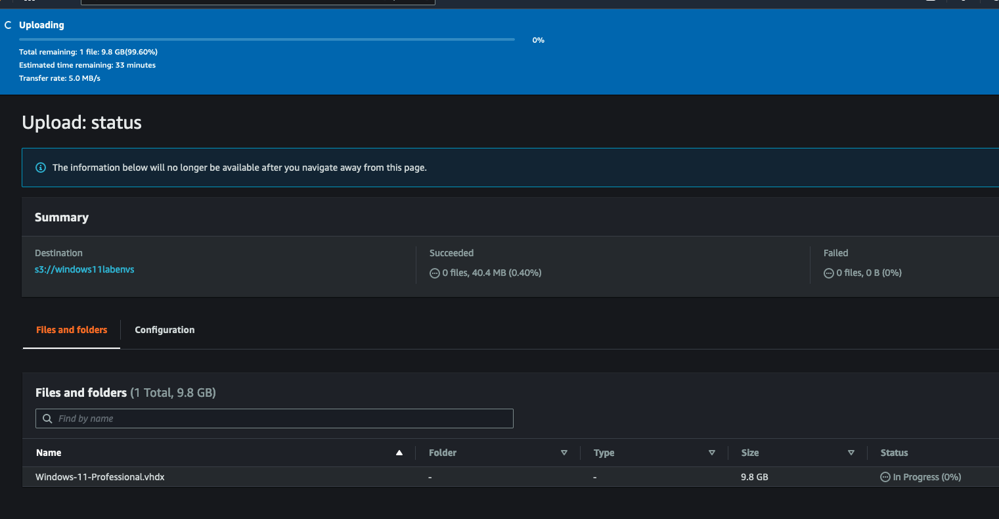
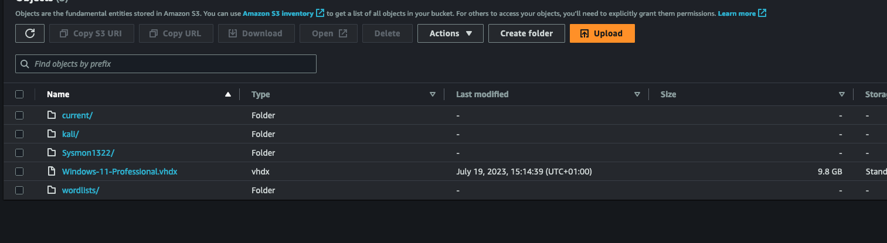

# Moving Windows 11 to AWS
This is the processes I had to do in order to import that vhdx file that was created in the documentation earlier. See [Installing Windows on a Fucking Mac](InstallingWindowsonaFuckingMac.md). 


## Create a Bucket 
> Login to Amazon S3
> On the top right, click create bukcet
[Title](MovingWindows11toAWS.md)
> Set the relevant settings,I just left them all AWS default, including the encryption settings

> Click on your AWS bucket you just created
> Click the 'Upload' button

> Click 'Add Files'

> Once you have uploaded the relevant Virtual mahine files for importing, click 'Upload\

> This is what you should see when uploading the file.

> Upload successful


## Importing the image

In AWS, we can use the cloudshell terminal to import the vhdx from the s3 bukcet we created earlier. So, to do that click on the  Terminal Icon to open the cloudshell CLI. 

From there, run the following commmands:
**Import the image**

Use the import-image command of the AWS Command Line Interface (CLI), specifying the image file in Amazon S3 and the --boot-mode parameter uefi. In the following example, replace bucketname with the name of the S3 bucket and filename with the name of your image file in the S3 bucket (e.g. Windows11.vhd).

```bash
aws ec2 import-image \
--disk-container UserBucket=\{S3Bucket=dl_sysmon,S3Key=\Windows-11-Professional.vhdx} \
--boot-mode uefi
```

Note: It is recommended to specify the boot mode as uefi to avoid confusion, though VM Import/Export will choose uefi based on the Windows 11 OS.

The import Task Id is displayed and the import process runs asynchronously.

Check the status of the import task using the command:
```bash
aws ec2 describe-import-image-tasks.
```


0cc0f3bb347000dc3
020f6cab524697994
013a4c67cae173352 (active) 

Message as of:

[cloudshell-user@ip-10-2-43-247 ~]$ aws ec2 describe-import-image-tasks --import-task-ids import-ami-0943ff1aa2147987b
{
    "ImportImageTasks": [
        {
            "ImportTaskId": "import-ami-0943ff1aa2147987b",
            "Progress": "19",
            "SnapshotDetails": [
                {
                    "DiskImageSize": 10544480256.0,
                    "Format": "VHDX",
                    "Status": "active",
                    "UserBucket": {
                        "S3Bucket": "dl-sysmon",
                        "S3Key": "Windows-11-Professional.vhdx"
                    }
                }
            ],
            "Status": "active",
            "StatusMessage": "converting",
            "Tags": [],
            "BootMode": "uefi"
        }
    ]
}


Update the stream and point them to the relevant thing
    powershell
    sysmon 
    windows

Sysmon

Nxlog

Upload the nxlog config file to graylog 


sidecar deployed on
    Windows DC
    Windows 11

